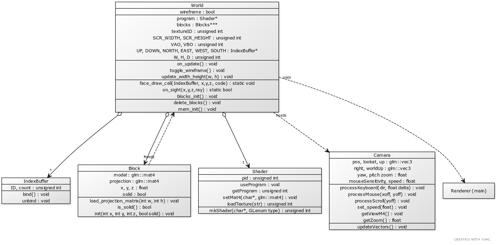

# Minecraft-Clone-OpenGL
<b>To exec:</b>
```bash
git clone https://github.com/Cesarmosqueira/Minecraft-Clone-OpenGL.git
cd Minecraft-Clone-OpenGL
./compile && ./run
```
# Controls
<kbd>W</kbd><kbd>A</kbd><kbd>S</kbd><kbd>D</kbd> <b>Move</b>
  
<kbd>Ctrl</kbd> <kbd>Space</kbd> <b>Fly up and down</b>
 
<b>Hold <kbd>Shift</kbd> for speed boost</b>

<kbd>Tab</kbd> <b>Toggle wireframe view</b>

# Screenshots


# Diagram

